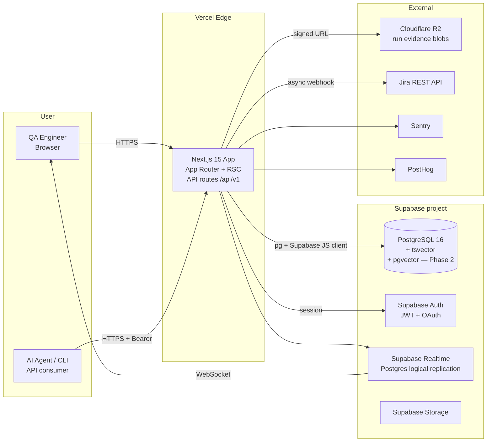
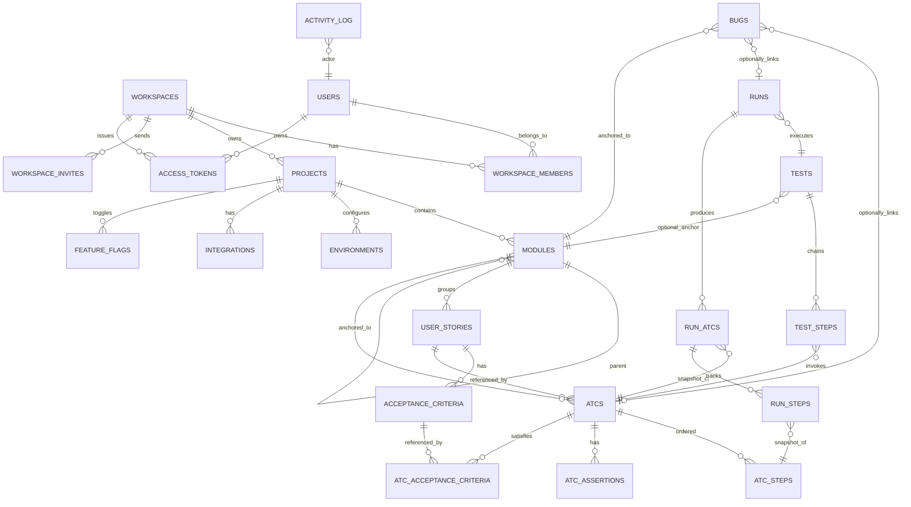

# Architecture Specifications — Bunkai MVP

> Two editions on the same codebase: **Bunkai Cloud** (Next.js + Supabase + Vercel + R2 + Sentry + PostHog) and **Bunkai Community** self-hosted (Docker Compose: Next.js + Postgres + Redis + MinIO + Better Auth). The MVP ships Cloud only; Community ships Phase 2.

---

## 1. System Architecture (C4 Level 1–2)



### Component summary

| Component | MVP edition | Self-hosted (Phase 2) substitute |
|---|---|---|
| Frontend | Next.js 15 App Router + RSC on Vercel | Same Next.js image in Docker, behind a reverse proxy |
| API | Next.js Route Handlers (`app/api/v1/...`) | Same; or extract to NestJS process when WebSocket / job queue load justifies it |
| DB | Supabase Postgres 16 | Postgres 16 in Docker (plain `postgres:16-alpine`) |
| Auth | Supabase Auth | Better Auth (or Auth.js) in-process |
| Realtime | Supabase Realtime | Redis pub/sub + custom WebSocket (extracted from Next.js) |
| Object store | Cloudflare R2 (S3-compatible) | MinIO (S3-compatible) in Docker |
| Background jobs | (MVP) Vercel cron + serverless functions for Jira sync, idempotency cleanup | BullMQ + Redis |
| Search | Postgres `tsvector` GIN | Same |
| Errors | Sentry SaaS | Sentry self-hosted (community plan) |
| Product analytics | PostHog Cloud | PostHog self-hosted |

## 2. Database Design (ERD)



### Entity quick reference

| Entity | Key columns | Notes |
|---|---|---|
| `workspaces` | `id`, `slug`, `name`, `owner_user_id`, `plan` | Tenant root. Plan ∈ {community, cloud, enterprise} (license gate). |
| `workspace_members` | `workspace_id`, `user_id`, `role`, `status` | RBAC. |
| `projects` | `id`, `workspace_id`, `slug`, `name` | App-under-test. |
| `modules` | `id`, `project_id`, `parent_module_id`, `path` (materialized) | Tree. Depth ≤ 6. |
| `user_stories` | `id`, `module_id`, `title`, `description`, `external_id`, `external_url` | Markdown body. |
| `acceptance_criteria` | `id`, `user_story_id`, `title`, `description`, `position` | Sortable. |
| `atcs` | `id`, `project_id`, `module_id`, `user_story_id`, `slug`, `title`, `layer`, `version`, `tsvector` | Searchable. |
| `atc_steps` | `id`, `atc_id`, `position`, `content`, `input_data`, `expected` | Ordered. |
| `atc_assertions` | `id`, `atc_id`, `position`, `content` | Ordered. |
| `atc_acceptance_criteria` | `atc_id`, `acceptance_criterion_id` | M:N. |
| `tests` | `id`, `project_id`, `module_id` (nullable), `title`, `tags[]` | Chain owner. |
| `test_steps` | `test_id`, `atc_id`, `position` | The chain. |
| `runs` | `id`, `test_id`, `environment`, `executor_type`, `executor_identity`, `status`, `started_at`, `finished_at`, `idempotency_key` | Run header. |
| `run_atcs` | `id`, `run_id`, `atc_id`, `position`, `status` | Per-ATC roll-up. |
| `run_steps` | `id`, `run_atc_id`, `atc_step_id`, `status`, `duration_ms`, `notes`, `evidence_url`, `error_message` | Per-step result. |
| `bugs` | `id`, `project_id`, `module_id`, `atc_id?`, `run_id?`, `title`, `severity`, `status`, `description`, `steps_to_reproduce`, `evidence_urls[]`, `external_id?` | Native defect. |
| `environments` | `project_id`, `name`, `web_url`, `api_url` | Run targeting. |
| `integrations` | `project_id`, `kind`, `config` (jsonb), `secrets_ref` | Jira, GitHub, etc. |
| `access_tokens` | `id`, `user_id`, `workspace_id?`, `hash`, `scopes`, `expires_at` | Bearer auth. |
| `activity_log` | `id`, `actor_id`, `action`, `entity_type`, `entity_id`, `payload_summary` | Audit-light. |
| `feature_flags` | `workspace_id?`, `project_id?`, `key`, `enabled` | Phase 2 gates. |
| `idempotency_keys` | `key`, `endpoint`, `response_snapshot`, `expires_at` | 24h TTL. |

> **No static SQL schemas in this file.** Use Supabase MCP (`db_mcp`) at runtime to read the live schema; the migration files (Supabase migrations or Drizzle if introduced) are the source of truth. Schema synthesis from this ERD is the responsibility of `/project-bootstrap`.

### Row Level Security policy summary

- Every table with `workspace_id` carries an RLS policy: `user is member of workspace_id with status='active'`.
- `viewer` role: read-only across all tables.
- `member` role: full CRUD on Project entities (Modules, US, AC, ATC, Test, Run, Bug) within Workspaces they belong to.
- `admin` role: also manages members + integrations + access tokens.
- `owner` role: also Workspace deletion + billing (Cloud plan).

Performance note: the founder conversation highlighted that RLS overhead becomes visible at scale. Mitigation: indexed `workspace_id` on every relevant table, plus `SET LOCAL row_security = off` for trusted server-side service-role queries that already pre-filter.

## 3. Tech Stack Justification

### Frontend — Next.js 15 (App Router, RSC) + React 19 + TypeScript

- ✅ Server-component-by-default reduces JS shipped to client; matches LCP/TTI budgets in NFR §1.
- ✅ Vercel deploy is zero-config; preview deploys per PR.
- ✅ shadcn/ui + Radix + Tailwind ecosystem is mature, AI-friendly, and the design tokens in `DESIGN.md` map cleanly.
- ✅ Monaco Editor + TanStack Table + React Flow have first-class React 19 support.
- ❌ App Router has a steeper learning curve than Pages Router; RSC + caching semantics are subtle. Mitigation: ADRs documenting our patterns.

### Backend (MVP) — Next.js Route Handlers

- ✅ Same repo, same language (TypeScript), shared types between client and server via Zod schemas.
- ✅ Server Actions + Route Handlers fit MVP's CRUD-heavy shape.
- ❌ Stateless serverless functions cap WebSocket and long-job ergonomics. Mitigation: Supabase Realtime covers Phase 1 push needs; Phase 2 extracts a NestJS service when agentic mode + CI imports demand persistent WebSocket + BullMQ.

### Database — Supabase Postgres 16 (Cloud edition)

- ✅ Familiar stack for the founder; faster MVP iteration.
- ✅ Auth + Realtime + Storage bundled — fewer integration surfaces in MVP.
- ✅ Postgres-native — `tsvector` for search; `pgvector` extension available for Phase 2 semantic search; recursive CTEs cover the tree view.
- ❌ Multi-tenant RLS has cost; Realtime via logical replication is limited (cannot fan out agentic-mode protocols at scale). Mitigation: Phase 2 introduces Redis pub/sub + WebSocket separately; Supabase Realtime remains for simple row-change UI updates.
- ❌ Lock-in to Supabase services. Mitigation: the Postgres schema is the only durable artifact; Supabase Auth / Storage / Realtime are swappable per the Community edition's Phase-2 plan (Better Auth, MinIO, custom WS).

### Storage — Cloudflare R2 (Cloud) / MinIO (Community)

- ✅ R2: S3-compatible, egress-free pricing for screenshot/video evidence at scale.
- ✅ MinIO: drop-in S3-compatible substitute in Docker, no behavior changes.

### Realtime — Supabase Realtime (Cloud) → Redis + WebSocket (Community, Phase 2)

- ✅ Simple row-change subscriptions to drive UI freshness in MVP.
- ✅ Phase 2 swap is contained: the frontend subscribes via a thin wrapper, swap implementation behind the wrapper.

### Auth — Supabase Auth (Cloud) → Better Auth (Community, Phase 2)

- ✅ Magic-link + OAuth out of the box for MVP.
- ✅ Better Auth (or Auth.js) self-hostable; no external SaaS dependency in Community edition.

### Observability — Sentry + PostHog (both have self-hostable counterparts)

- ✅ Both are open-source-friendly choices that survive the eventual transition to self-hosted.

### CI/CD — GitHub Actions

- ✅ Already in founder's daily workflow.
- ✅ Native preview deployments via Vercel GitHub integration.

## 4. Data Flow Examples

### 4.1 ATC creation

1. User submits the ATC form (Frontend, React + Zod schema).
2. Client-side validation passes; `POST /api/v1/atcs` with idempotency key.
3. Route handler validates the same Zod schema; resolves Workspace context from the Supabase session JWT.
4. RLS policy verifies the caller is a `member` of the resolved Workspace.
5. Transactional insert: `atcs`, `atc_steps`, `atc_assertions`, `atc_acceptance_criteria`.
6. `activity_log` insert; emit `atc.created` event.
7. Supabase Realtime broadcasts row change to subscribed clients (Project View tree refreshes the new node).
8. Response 201 with the ATC payload.

### 4.2 Manual Run step result

1. QA marks step pass in the runner (Frontend).
2. `POST /api/v1/runs/{run_id}/steps/{run_step_id}/result`.
3. Route handler updates `run_steps`, recomputes parent `run_atcs.status` and `runs.progress_pct` in a transaction.
4. Realtime broadcasts `run_steps` row change.
5. Other tabs watching this Run update without reload.
6. Response 200 with the updated step + derived statuses.

### 4.3 Agent-driven Run

1. Agent authenticates with `Authorization: Bearer bk_pat_...`.
2. `POST /api/v1/runs` with `idempotency_key` → 201 `{ run_id }`.
3. For each step: `POST /api/v1/runs/{run_id}/steps/{step_id}/result` (same shape as the manual flow).
4. On failure: `POST /api/v1/bugs` with `{ run_id, atc_id, module_id, severity, ... }` → 201 `{ bug_id }`.
5. `POST /api/v1/runs/{run_id}/finish` → 200.

The shape of the data produced is identical to a human-driven Run. Dashboards aggregate without conditional logic.

### 4.4 Jira import (Phase 2 placeholder — async)

1. `POST /api/v1/imports/jira` with `{ project_id, jql }`.
2. Route handler enqueues a job (Vercel cron-triggered worker in MVP; BullMQ + Redis in Community/Phase 2).
3. Worker polls Jira REST API in pages, parses each issue, dedupes by `external_id`, inserts `user_stories` + extracted `acceptance_criteria`.
4. Client polls `/imports/{id}` for status, or subscribes via Realtime to the `imports` table.

## 5. Security Architecture

### Auth flow (end-user)

```
Browser ─ /auth/sign-in ──► Next.js ─ supabase.auth.signInWith{OAuth|Otp} ──► Supabase Auth
                                                          │
                                                          ▼
                                                JWT in HttpOnly cookie
                                                          │
                                                          ▼
                                  Next.js middleware extracts JWT, resolves
                                  session → propagates workspace_id to handlers
```

### Auth flow (API / CLI / Agent)

```
CLI ─ /auth/login (device-code flow) ──► Next.js ─ issue PAT ──► access_tokens table
                                                                       │
                                                                       ▼
                                                          token_prefix + sha256(hash)
                                                                       │
Request ─ Authorization: Bearer bk_pat_... ──► middleware
                                                  ├── lookup hash, verify expiry/revocation
                                                  ├── attach { user_id, workspace_id?, scopes }
                                                  └── proceed to handler
```

### RBAC

- Enforced at two layers: (1) **RLS policies** on Postgres for data isolation; (2) **route-handler guards** for non-CRUD actions.
- Role inheritance: `viewer ⊂ member ⊂ admin ⊂ owner`.
- Token scopes are an additional restriction layered on top of role (e.g. a `member` user can mint a read-only token that cannot create ATCs).

### Data protection

- All API responses pass through a response shaper that strips internal fields (`*_internal`, `payload_summary`).
- Markdown content sanitized via `rehype-sanitize` with an allowlist that excludes scripts, inline event handlers, and iframes (except a known-good Mermaid renderer).
- Webhook URLs (Jira sync, integrations) validated against an allowlist of public hostnames; private IP ranges rejected.
- Personal Access Tokens hashed with SHA-256 (no Argon needed — tokens are random 32-byte secrets).

## 6. ADRs (Architecture Decision Records) — pending

Create these under `docs/decisions/` as the MVP progresses:

- **ADR-001**: Supabase for MVP, plan Phase-2 substitution path for Community edition.
- **ADR-002**: Next.js Route Handlers for API in MVP; extract NestJS when agentic mode demands persistent WebSocket.
- **ADR-003**: Tree view via recursive CTE; revisit Apache AGE if mind-map view performance degrades.
- **ADR-004**: Markdown is the canonical content format; storage as plain text + sanitized render-time pipeline.
- **ADR-005**: Idempotency-Key header convention; 24h TTL.
- **ADR-006**: RLS-first authorization; service-role only for migrations + scheduled jobs.

---

## Cross-references

- Feature requirements: `.context/SRS/functional-specs.md`.
- Performance / security NFRs: `.context/SRS/non-functional-specs.md`.
- API contract: `.context/SRS/api-contracts.yaml`.
- Visual design: `DESIGN.md`.
